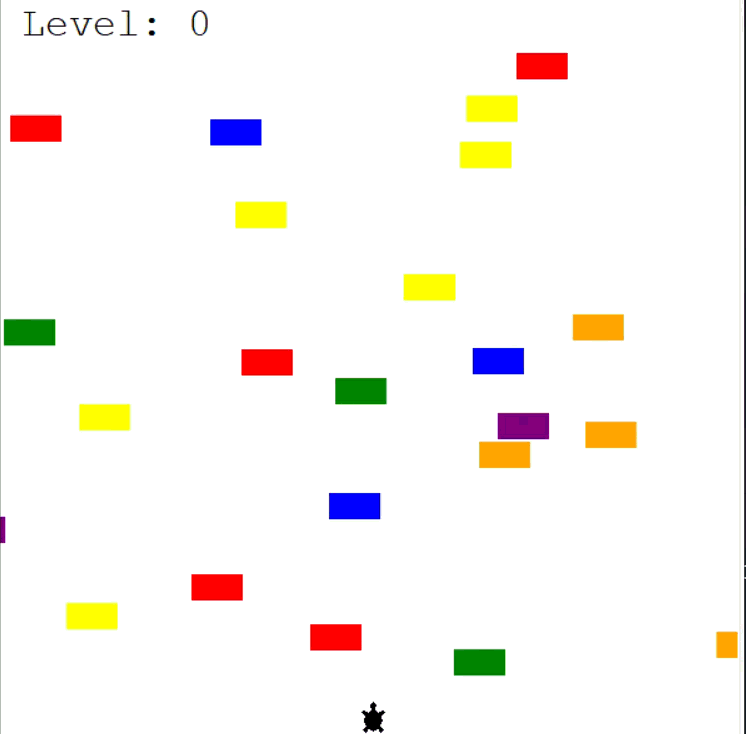
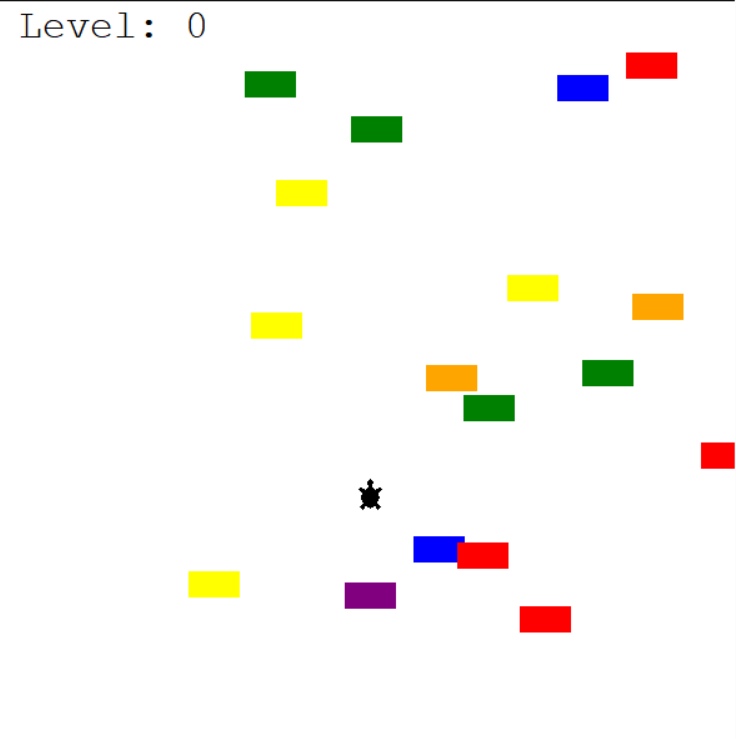
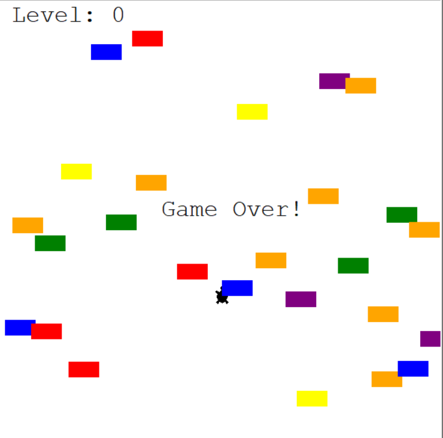

# 🐢 Turtle Crossing Game

A simple and engaging Python game built using the Turtle graphics library.  
Help the turtle cross a busy road filled with speeding cars. Each successful crossing increases the game's difficulty!

---

## 🎮 Game Features

- Control the turtle using the **Up Arrow key**.
- Cars spawn at random positions and move from right to left.
- Each time the turtle crosses successfully, the level increases and cars speed up.
- Collision with a car ends the game with a "Game Over" message.

---

## 🚀 How to Run the Game

1. Make sure Python 3 is installed on your system.
2. Clone this repository or download all files into a single folder:
   - `main.py`
   - `player.py`
   - `car_manager.py`
   - `scoreboard.py`
   - `game_start.png`
   - `game_over.png`
3. Open the terminal in that folder and run:

```bash
python main.py
```

---

## 📽 Demo




---

## 🖼️ Game Screenshots

### ✅ Game Start
The game starts with a turtle at the bottom, ready to cross the road:


### ❌ Game Over
When the turtle is hit by a car, the game ends:


---

## 🛠️ Project Structure

```
turtle-crossing-game/
│
├── main.py              # Game loop and control
├── player.py            # Player (turtle) class
├── car_manager.py       # Car creation and movement logic
├── scoreboard.py        # Score tracking and level display
├── game_start.png       # Screenshot of the game at start
├── game_over.png        # Screenshot of game over state
└── README.md            # Project documentation
```

---

## 📦 Requirements

No external libraries are required.  
Everything is built using the **Turtle** module which is included in Python by default.

---

## 🧑‍💻 Author

Created by **Saurabh Kulshrestha**  
Enjoy coding and keep learning! ✨

